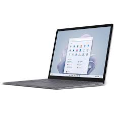

===============
Introduction
===============
Products
--------

- Dell XPS 15 2023

.. figure:: download.jpg
   :align: center

   When it comes to the best 15-inch laptops, Dell's XPS 15 has been at the top of the list for as long as I remember. One of the reasons is that it pretty much defined its category. Up until a few years ago, a premium 15-inch laptop with the power to edit videos was really something you'd either find in the gaming laptop market, or from Apple.The XPS 15 (2023) that Dell sent to me includes an Intel Core i7-13700H and an Nvidia GeForce RTX 4070, and yet it comes in at 4.23 pounds. It's that perfect mixture of power and portability, and of course, it's combined with a beautiful 3.5K OLED display.

- Surface Laptop 5

   Multitasking speed powered by 12th Gen Intel® Core™ i5/i7 processors built on the Intel® Evo™ platform, with Windows 11 and a vibrant touchscreen. Sleek and beautiful, in your choice of size.¹ And battery life² for real life to do your thing your way all day. Surface Laptop 5 gives you the perfect balance to do it all.

for Comparison you can cheak out this websites, like `Comparison
<https://www.xda-developers.com/dell-xps-15-2023-vs-surface-laptop-5/>`_.

`home <index.html>`_